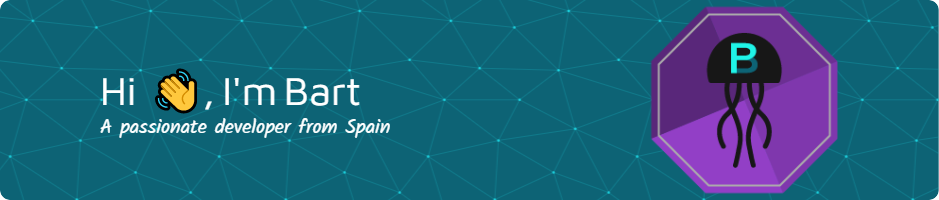

<!--
<h1 align="center">Hi 👋, I'm Bart</h1>
<h3 align="center">A passionate developer from Spain</h3>-->

   

   
  

- 🌱 I’m currently learning **everything**

- 👨‍💻 All of my projects are available at [https://barthxc.github.io](https://barthxc.github.io)

- 💬 Ask me about **🐜ANTS!❤️** 

- 📫 How to reach me **barthxc.business@gmail.com**

<h3 align="left">Connect with me:</h3>

<h3 align="left">Languages and Tools:</h3>

                        

  

<!--

{:target="_blank"}

 
Arreglar este markwdown para hacer un img de target blank 
Usar otro diseño (?)
-->

